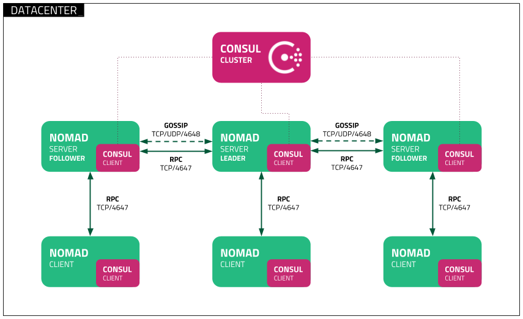

# Nomad and Consul Setup on GCP

This guide covers how to run **Nomad** and **Consul** in Google Cloud Platform (GCP) using **Packer** to build custom images meeting Hashicorps [Reference Architecture](https://developer.hashicorp.com/nomad/tutorials/enterprise/production-reference-architecture-vm-with-consul)


## Prerequisites

Ensure you have the following tools installed before proceeding:

- [Google Cloud CLI (gcloud)](https://cloud.google.com/sdk/docs/install)
- [HashiCorp Packer](https://developer.hashicorp.com/packer/tutorials/docker-get-started/get-started-install-cli)
- **Nomad License File**

## Step 1: Authenticate with GCP

First, authenticate with your GCP account and configure the project you want to use:

```bash
# Authenticate your GCP account
gcloud auth application-default login

# Set your Google Cloud project ID
gcloud config set project <PROJECT_ID>
```

Replace `<PROJECT_ID>` with your actual GCP project ID.

## Step 2: Prepare to Build Images

### Configure License Files

Copy your license files (`nomad.hclic` & `consul.hclic` ) to the root of your working directory, an exmaple of this is as follows:

```bash
cp ~/Downloads/nomad.hclic .
cp ~/Downloads/consul.hclic .
```

Ensure that the license file is present before you run the Packer build.

## Step 3: Build the Disk Image with Packer

### Set Image Variables

You need to configure the variables for the Packer build. Run the script to set up the necessary variables:

```bash
sh packer/set-vars.sh
```

This script will prompt you for your GCP project ID, region, and other details. By default, it uses **London (europe-west2)** as the region. You can modify the script or input a different region during execution if necessary.

### Build Images

Once the variables are set, use Packer to build the images for both Nomad server and Nomad client. I have also provided a simple script to run both the server and client builds simultaneously: `./build-packer.sh`:

```bash
# Initialize Packer
packer init packer/gcp-almalinux-nomad-server.pkr.hcl
packer init packer/gcp-almalinux-nomad-client.pkr.hcl

# Build Nomad server image
packer build -var-file=variables.pkrvars.hcl packer/gcp-almalinux-nomad-server.pkr.hcl

# Build Nomad client image
packer build -var-file=variables.pkrvars.hcl packer/gcp-almalinux-nomad-client.pkr.hcl
```

## Step 4: Provision Nomad
This will use terraform to provision a 3 node Nomad cluster with 1 addtional client creating a tfvars file from the our orignal pkrvars we used ealier. 
```bash
sed  '/image_family.*/d' variables.pkrvars.hcl > tf/terraform.tfvars
cd tf
terraform init
terraform apply
```

## K8s Integration

Work in progress—check back later for Kubernetes integration steps.